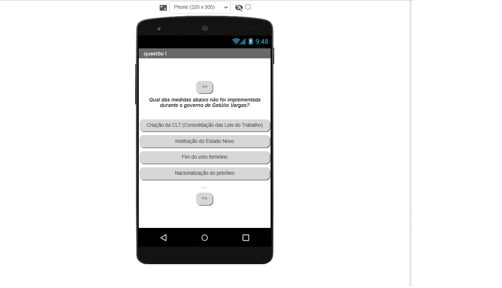
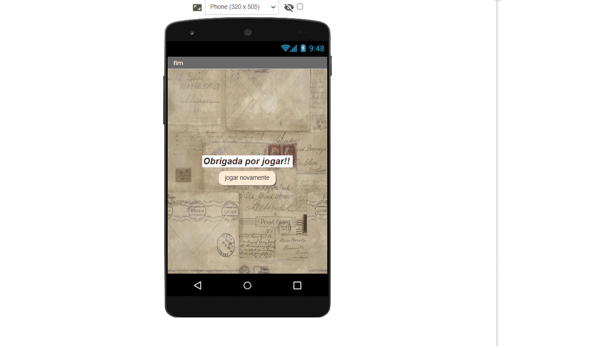

# Quiz de História Geral
por: Maria e Lohaine

### Tecnologias utilizadas
- Mit App Inventor;
- .apk;
- .aia

Tela inicial:

Exemplo do quiz (questão 1):

Exemplo do quiz (questão 8):

Página final:

### Opiniões

A professora adorou e falou que as perguntas foram ótimas.

